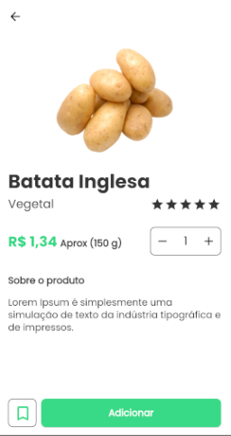
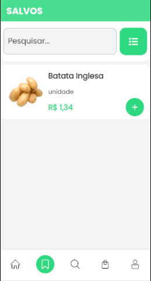
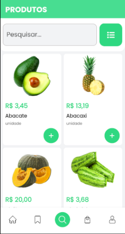
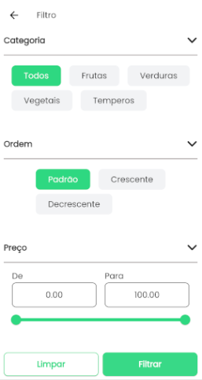

# FEIRAPP

Feirapp é um aplicativo de hortifruti desenvolvido com o objetivo de ser uma solução prática para facilitar a organização e a compra de produtos de feira. Criado com foco em ser utilizado no dia a dia, o Feirapp também serve como uma base sólida para meus estudos sobre Clean Architecture no Flutter.

Este projeto foi construído para consolidar o uso de boas práticas de desenvolvimento, seguindo padrões arquiteturais que garantem um código modular, testável e escalável. Além disso, ele oferece uma experiência de usuário simples e eficiente.

## SCREENSHOTS

WELCOME PAGE

LOGIN PAGE

INIT PAGE

PRODUCT PAGE

FAVORITES PAGE

SEARCH PAGE

FILTER PAGE

CART PAGE

CONFIG PAGE

